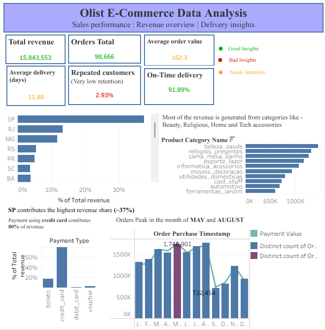

# Olist E-Commerce Data Analysis — Tableau Dashboard
 

 
> **Sales Performance | Revenue Overview | Delivery Insights**  
> Built using the Brazilian Olist E-Commerce public dataset with 5 joined tables in Tableau.
 
---
 
## Project Overview
 
This dashboard analyzes **98,666 orders** placed on the Olist e-commerce platform in Brazil. The goal was to uncover revenue patterns, customer behavior, delivery performance, and product category trends — and present them as a clean, story-driven dashboard.
 
---
 
## Key Insights
 
| Insight | Finding |
|---|---|
| Top State | Heavy dependency on SP (~37%) suggests revenue concentration risk—expansion into underperforming states could improve stability.|
| Payment Preference | **Credit card drives 80%** of all revenue |
| Peak Months | Orders peak in **May and August** |
| Customer Retention | Only **2.93% repeated customers** — a major growth opportunity |
| Delivery Performance | **91.89% on-time delivery** rate |
| Avg Delivery Time | **11.98 days** average delivery |
| Avg Order Value | **R$ 162.3** per order |
| Top Categories | Beauty & Health, Watches, Bed/Bath lead revenue |
 
---
 
## Dataset
 
**Source:** [Olist Brazilian E-Commerce Dataset — Kaggle](https://www.kaggle.com/datasets/olistbr/brazilian-ecommerce)
 
### Tables Used
 
| Table | Description |
|---|---|
| `olist_orders_dataset.csv` | Order status, timestamps, delivery dates |
| `olist_customers_dataset.csv` | Customer city and state |
| `olist_order_items_dataset.csv` | Products per order |
| `olist_products_dataset.csv` | Product category names |
| `olist_order_payments_dataset.csv` | Payment type, value, installments |
 
### Table Joins
```
orders ──── customers       (on customer_id)
orders ──── order_items     (on order_id)
order_items ── products     (on product_id)
orders ──── payments        (on order_id)
```
 
---
 
## Dashboard Charts
 
### KPI Cards (Top Row)
- Total Revenue, Orders Total, Average Order Value
- Average Delivery Days, Repeated Customers, On-Time Delivery %
- Color coded: 🟢 Good | 🔴 Bad | 🟡 Needs Attention
### Revenue by State
- Horizontal bar chart showing top 8 states by % of total revenue
- SP dominates at ~37%, followed by RJ and MG
### Revenue by Product Category
- Top 10 categories by total revenue
- Beauty & Health (beleza_saude) leads at R$ 1.5M+
### Order Purchase Timestamp
- Monthly revenue trend with dual axis (order count overlay)
- Peak months highlighted — **May 2018: R$ 1,746,901**
- Low point annotated — **August 2018: R$ 732,454**
### Payment Type Breakdown
- Bar chart showing % of revenue by payment method
- Credit card dominates at ~80%
---

 ## 📈 Business Recommendations

- Improve customer retention through loyalty programs and targeted marketing campaigns
- Expand operations in underperforming states to reduce geographic dependency
- Optimize delivery timelines to enhance customer satisfaction and repeat purchases
- Focus on high-performing categories (Beauty, Home) for revenue growth

## Tools & Skills
 
- **Tableau Desktop** — dashboard design, calculated fields, dual axis, annotations
- **Data Joining** — 5 tables joined in Tableau Data Source tab
- **Calculated Fields** — peak month flag, % of total revenue, retention rate
- **Storytelling** — insight annotations added directly on charts
---
 
## How to Open
 
1. Download `olist_ecommerce_analysis.twbx`
2. Open with **Tableau Desktop** or **Tableau Public** (free)
3. All data is embedded in the `.twbx` file — no separate CSV downloads needed
---
 
## 📌 What I Learned
 
- How to join multiple datasets and manage relationships in Tableau
- How to use calculated fields for dynamic highlighting (peak months, color flags)
- How to tell a data story with annotations, not just charts
- Dashboard layout and design — balancing information density with readability
- Iterative design — improved the dashboard through multiple feedback cycles
---
 
## Author
 
**[Sweety Sharma]**  
[sweetyy955@gmail.com]
 
---
 
⭐ If you found this useful, feel free to star the repo!
